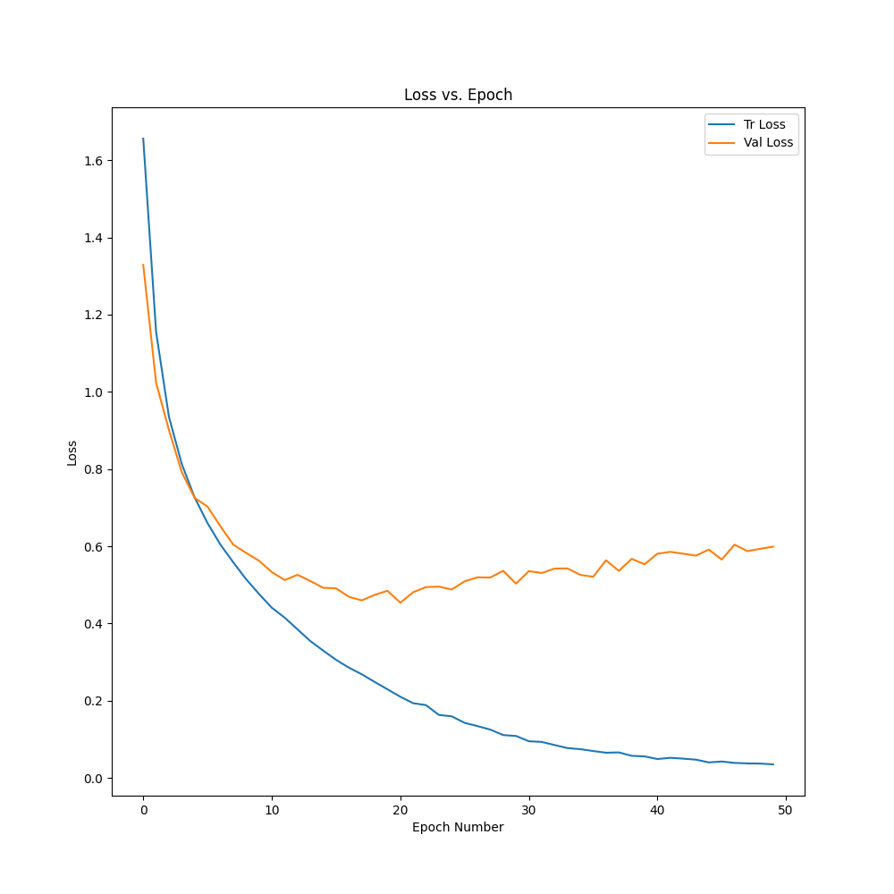
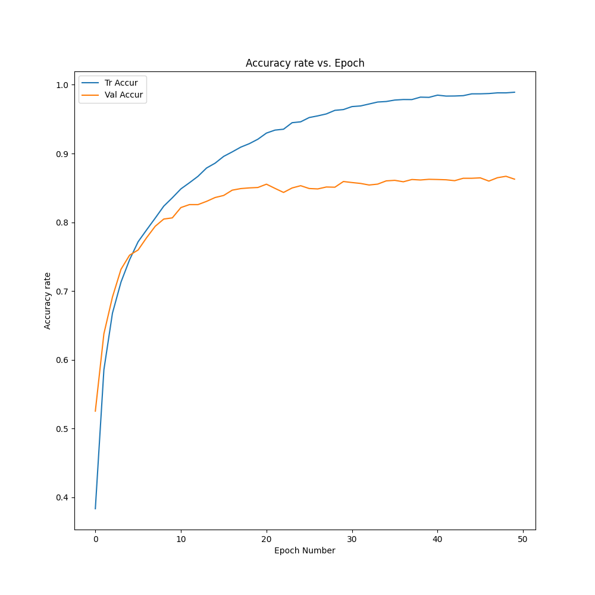

# Image Identification Using CNN

## Description
Given the image, we will give it one of ten labels based on the content in the image.
Labels: airplane, automobile, bird, cat, deer, dog, frog, horse

## Data
Image data are all from CIFAR-10.

## Basic Model
The accuracy rate of ```Net``` model in the ```models.py``` is 58%.<br />
The accuracy rate of ```ImprovedNet``` model in the ```models.py``` is 64%.

## Preprocess
Data augmentation: random flip and image whitening

## Train Process
Apply ```CrossEntropyLoss()``` for loss calculation. <br />
Apply ```torch.optim.SGD()``` with learning rate 0.001 for gradient calculation. <br />
Apply 50 epochs. <br />

## Result
| Method | Accuracy |
| -------- | ------ |
| Net Model | 58% |
| ImprovedNet Model | 64% |
| ImprovedNet with image preprocessing | 75% |
| ImprovedNet with batch normalization, weight decay and more convolution layers | 84% |
| Resnet Model | 87% |

## Train and Test Loss


## Train and Test Accuracy
